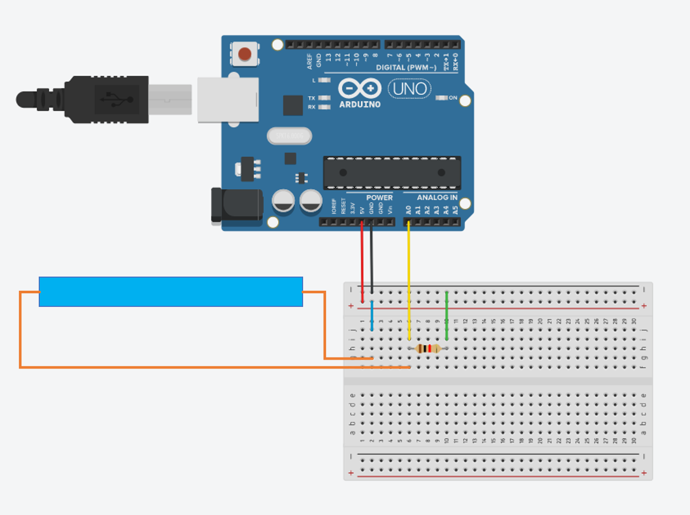
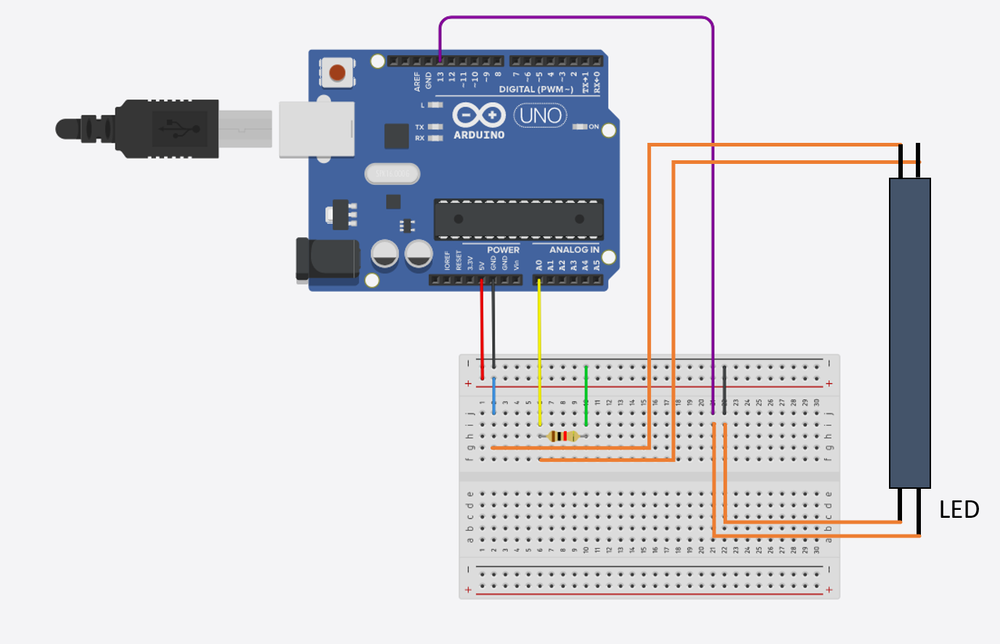
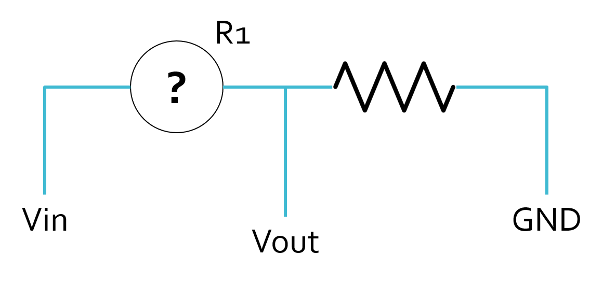

# Deformable Controllers ReadMe
Resources for making deformable controllers.

This repository contains materials such as instructions and codes for making and testing sensors used in deformable controllers.

## Bend/Pressure Sensor

Use the following schematic to test the bend/pressure sensor (the resistor you use might be different than what's shown) with the processing code. You'll see a progress bar filling up when bent.

## Optical Sensor

Use the following schematic to test the optical sensor (the resistor you use might be different than what's shown) with the processing code. You'll see a progress bar filling up when bent.

## Troubleshoot and Q&A

1. I got a "ArrayIndexOutofBoundException" when running the processing code.

It means Processing cannot find your Arduino board. Make sure you have connected the board to your computer. If the problem persists, try other USB ports.

2. The processing code runs but the progress bar doesn't move.

Either your Arduino is not running StandardFirmata (upload it from the Arduino IDE), or there is something wrong with the wiring (double-check the schemtic). Talk to us if both don't address the issue.

3. What am I actually making with the Arduion?

You are making a potential divider that measures the voltage drop with a current passes through your sensor. The processing code converts it into resistance (R1) and visualizes it as a progress bar.

